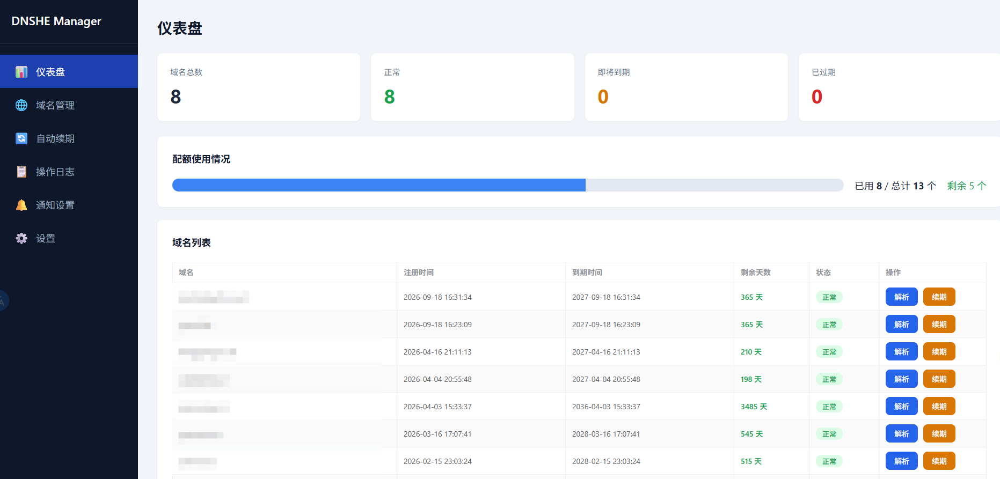
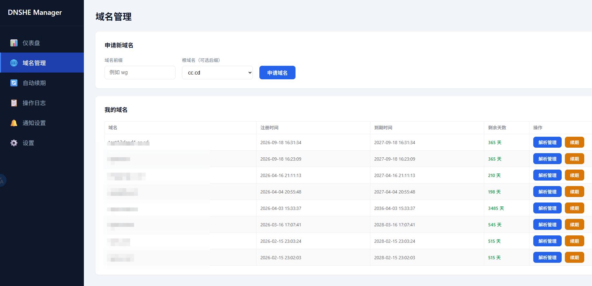
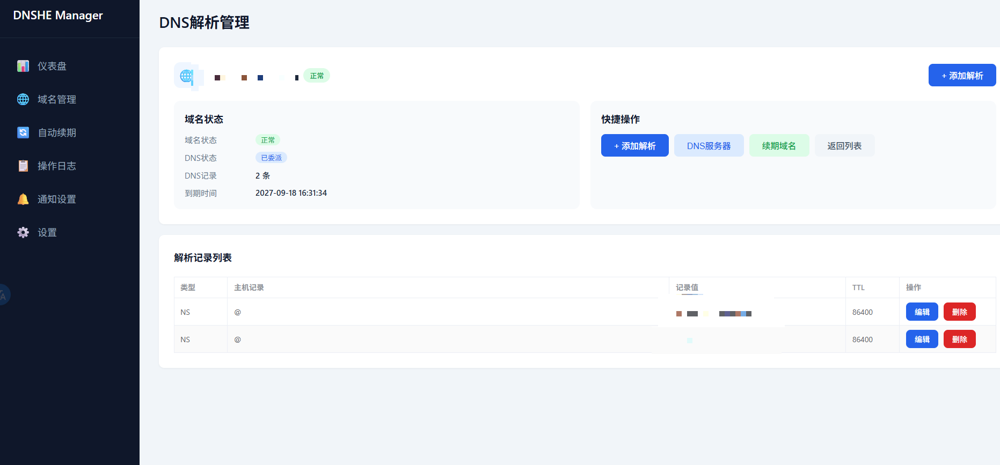
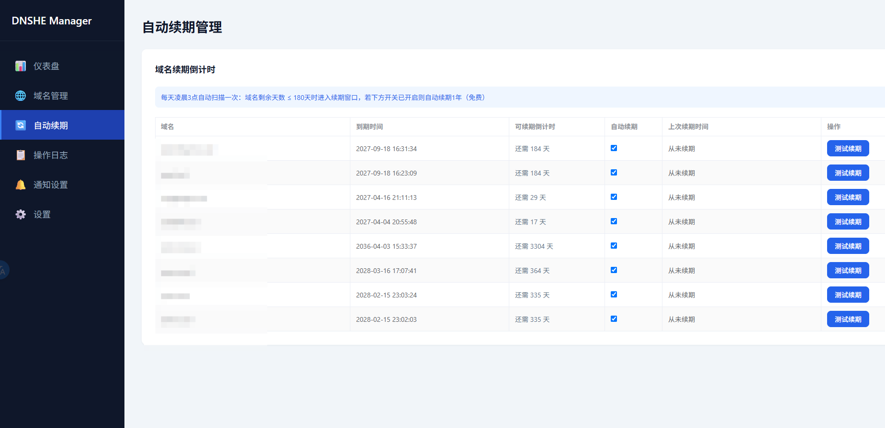
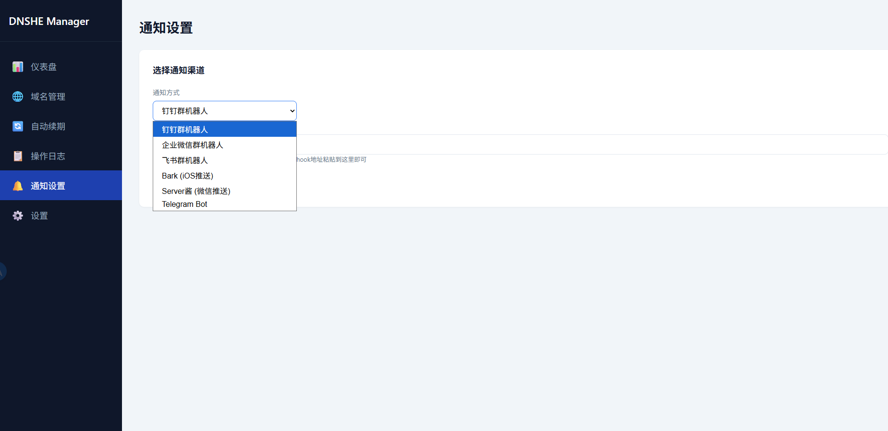
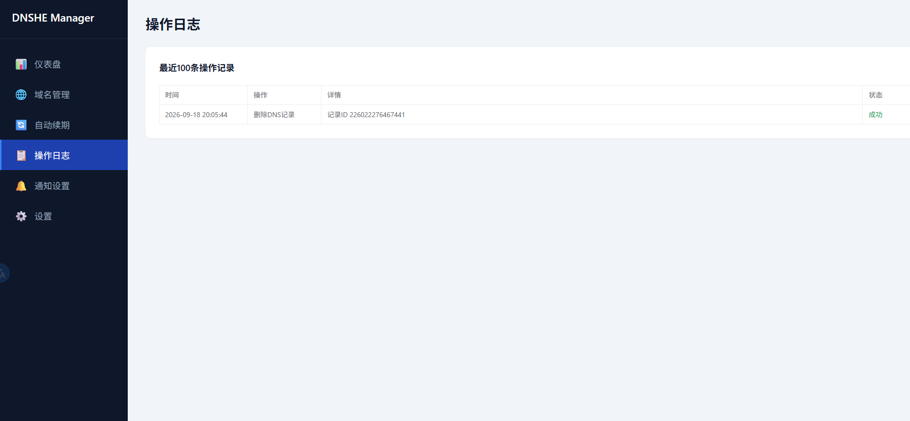

# DNSHE Manager

[]()
[]()

一个轻量自托管的 DNSHE 免费域名管理 WebUI，基于 FastAPI + Vue3 + SQLite 构建，Docker 一键部署。

## 📸 预览
| 仪表盘 | 域名管理 |
|--------|----------|
|  |  |

| DNS解析管理 | 自动续期 |
|-------------|----------|
|  |  |

| 通知设置 | 操作日志 |
|----------|----------|
|  |  |

## ✨ 功能特性

- 📊 **仪表盘**：域名总数统计、配额使用进度条、彩色状态标签
- 🌐 **域名管理**：
  - 一键查看所有子域名、注册时间、到期时间、剩余天数
  - 申请新子域名（自动拉取可用根域名列表）
  - 一键续期
- 🔧 **DNS 解析管理**：
  - 支持 A / AAAA / CNAME / TXT / MX / NS / SRV / CAA 全记录类型
  - 记录的增删改查，表单类型联动（MX/SRV/CAA 自动显示对应字段）
  - 域名委派（自定义 NS 服务器）
- 🔄 **自动续期**：
  - 每个域名单独开关自动续期
  - 可视化倒计时（显示距离进入 180 天续期窗口还有多少天）
  - 每天凌晨自动扫描，进入续期窗口自动续 1 年
- 🔔 **多渠道通知**：续期成功/失败自动推送
  - 钉钉/企业微信/飞书群机器人
  - Bark（iOS 推送）
  - Server酱（微信推送）
  - Telegram Bot（支持自定义代理）
- 📋 **操作日志**：所有手动/自动操作完整记录，成功失败一目了然
- 🔒 **安全**：API Key 仅后端存储，前端不暴露；密码密文输入；删除配置二次验证码确认

## 🚀 一键部署（推荐）

只要一个 `docker-compose.yml`，不用clone代码：

```yaml
services:
  dnshe-manager:
    image: ghcr.io/ryon718/dnshe-manager:latest
    container_name: dnshe-manager
    ports:
      - "8100:8080"
    volumes:
      - ./data:/app/data
    environment:
      - TZ=Asia/Shanghai
    restart: unless-stopped
```

然后执行：
```bash
docker-compose up -d
```
打开 `http://你的IP:8100` 就完事。

### 本地源码构建部署
如果你想自己改代码，clone仓库后执行：
```bash
docker-compose up -d --build
```

## 📝 说明
- 本项目为第三方非官方工具，与 DNSHE 官方无关
- 免费版 API 不支持通过 API 删除子域名，如需删除请前往 DNSHE 官方后台操作
- 默认 API 限速 60次/分钟，本项目所有请求均为后端代理，不会超限
- 首次使用请先在 DNSHE 客户区创建 API 密钥，在系统设置页填入即可

如果觉得好用，麻烦点个 Star ⭐ 支持一下~

## 📅 更新日志
### v1.1 (2026-09-18)
- ✨ 新增登录鉴权模块：独立登录页，所有接口需登录访问
- 🔒 密码bcrypt哈希存储，数据库不存明文
- 🛡️ 安全加固：连续5次登录失败封IP10分钟，Token7天自动过期
- 👤 支持修改登录用户名、修改登录密码、退出登录
- 🐛 修复登录页刷新报错、修改密码弹窗全局可用等多个问题

### v1.0 (2026-09-18)
- 首个正式版本
- 完整域名管理、DNS解析、自动续期、多渠道通知功能

## 📄 License
MIT
